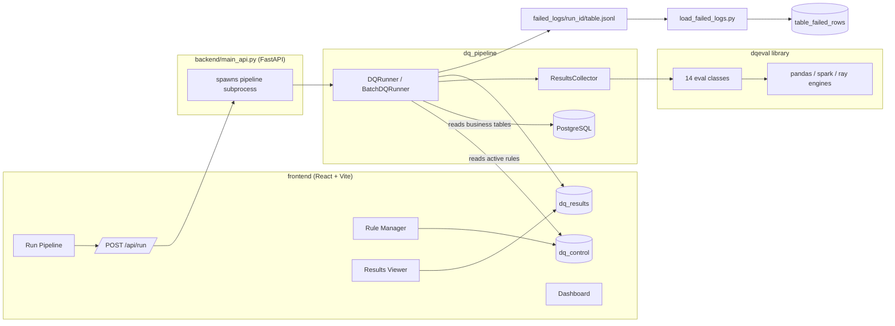

# Data Quality Evaluation (DQ Eval)

Last Updated: 03 August 2026

> **Note:** This asset is intended for internal use within Microsoft.

## About

**DQ Eval** is a configuration-driven Data Quality platform for PostgreSQL. Validation rules are stored as metadata (not code), executed by a reusable multi-engine Python library (`dqeval`), orchestrated by a chunk-aware pipeline (`dq_pipeline`), exposed through a FastAPI backend, and visualized in a React dashboard.

Define a rule once → run it against a table of any size → see pass/fail KPIs and drill into the exact rows that failed.

## Key Contributors
- **Creation Date**: August 2026
- **Last Update**: 03 August 2026
- **Owners**:
- Ram Yerabotu ([ramyerrabotu@microsoft.com](mailto:ramyerrabotu@microsoft.com))
- **Reviewers**:
- RK Iyer ([raiy@microsoft.com](mailto:raiy@microsoft.com))
- Ram Yerabotu ([ramyerrabotu@microsoft.com](mailto:ramyerrabotu@microsoft.com))

- **Contributors**:
- Ram Yerabotu ([ramyerrabotu@microsoft.com](mailto:ramyerrabotu@microsoft.com))
- MuraliKrishnan N ([murn@microsoft.com](mailto:murn@microsoft.com))
- HariKrishnan S ([hariks@microsoft.com](mailto:hariks@microsoft.com))
- Mallikarjun Kotgire ([mkotgire@microsoft.com](mailto:mkotgire@microsoft.com))

---

## Table of Contents

- [Architecture](#architecture)
- [How It Works — End to End](#how-it-works--end-to-end)
- [The `dqeval` Library](#the-dqeval-library)
- [Supported Validation Checks](#supported-validation-checks)
- [Database Schema](#database-schema)
- [Setup](#setup)
- [Running the Pipeline (CLI)](#running-the-pipeline-cli)
- [Running the Web UI](#running-the-web-ui)
- [Using the UI](#using-the-ui)
- [Utility Scripts](#utility-scripts)
- [Security Notes](#security-notes)

---

## Architecture



| Layer | Technology | Responsibility |
|---|---|---|
| `dqeval/` | Python (pandas / Spark / Ray) | Engine-agnostic evaluation library — 14 rule types |
| `dq_pipeline/` | Python + SQLAlchemy | Metadata-driven orchestration against PostgreSQL |
| `backend/` | FastAPI | REST API — rules CRUD, run triggering, results/failure queries |
| `frontend/` | React + Vite + Tailwind + TypeScript | Rule Manager, Run Pipeline, Results Viewer, Dashboard |
| Database | PostgreSQL (Azure) | `dq_control`, `dq_results`, business tables |

## How It Works — End to End

1. **Define rules** — a rule (schema + table + check type + JSON config) is created via the Rule Manager UI (or directly with SQL) and stored as a row in the `dq_control` table.
2. **Trigger a run** — clicking "Run Pipeline" in the UI calls `POST /api/run`, which spawns `python main.py` as a subprocess with a generated `run_id`.
3. **Load rules** — `DQRunner`/`BatchDQRunner` loads all `is_active = TRUE` rows from `dq_control` and groups them by `(schema_name, table_name)`.
4. **Evaluate** — for each table, the data is read from Postgres (in full, or streamed in chunks for huge tables), wrapped in a `DqEvalDataFrame`, and every rule is executed through `ResultsCollector`, which dispatches to the matching `dqeval` eval class.
5. **Persist results** — aggregated pass/fail counts are written to `dq_results`; the exact rows that failed each check are streamed to `failed_logs/<run_id>/<table_name>.jsonl` (kept out of the DB to stay lightweight).
6. **Visualize** — the Dashboard and Results Viewer pages read back `dq_results` (and the failure logs) through the FastAPI backend, showing KPIs, charts, and row-level drill-downs.
7. **(Optional) Promote failures to SQL** — `load_failed_logs.py` flattens the JSONL failure logs into queryable `<table>_failed_rows` Postgres tables.

## The `dqeval` Library

`dqeval` is the core, engine-agnostic evaluation engine — it knows nothing about Postgres or the UI, only "given this dataframe and this config, what passed or failed."

- **`DqEvalDataFrame`** wraps a raw dataframe and auto-detects whether it's pandas, Spark (incl. Spark Connect), or Ray.
- **`BaseDQEval`** is the abstract base every check extends — it requires `run(evaluation="basic"|"advanced")` and `expected_config()` (a declarative config schema enforced by `ConfigValidator` before execution).
- **Eval classes** (`dqeval/evals/*.py`) contain only config validation/dispatch logic.
- **`EngineRunner`** + per-engine classes (`PandasEngine`, `SparkEngine`, `RayEngine`, all extending `BaseEngine`) contain the actual computation — one implementation per backend.
- **`"basic"` vs `"advanced"` mode**: basic returns a JSON summary (status, total/failed/passed counts); advanced additionally returns a dataframe of the exact failing rows, which is what powers the failed-row drill-down in the UI.

Because dispatch is purely based on the dataframe's detected engine, the same rule config works unmodified whether the underlying data is a small pandas table or a massive Spark table.

## Supported Validation Checks

| `dqmethod` | Category | What it checks |
|---|---|---|
| `DupEval` | Integrity | Duplicate rows based on one or more key columns |
| `EmptyEval` | Completeness | Null / blank values in selected columns |
| `UniqueEval` | Integrity | A column's values are unique across all rows |
| `DtypeEval` | Schema | Column values convert cleanly to expected types |
| `StringFormatEval` | Validity | Text matches a regex pattern (email, UUID, date, etc.) |
| `RangeEval` | Validity | Numeric column falls within a min/max range |
| `CategoricalValuesEval` | Validity | Column values are within an allowed set |
| `StatisticalDistributionEval` | Distribution | Feature drift (mean/std vs. reference) or label balance |
| `DataFreshnessEval` | Timeliness | Timestamp column is within a freshness threshold (e.g. `-2h`) |
| `ReferentialIntegrityEval` | Integrity | Foreign-key-style match against a reference table/column |
| `RowCountEval` | Volume | Table row count falls within a min/max range |
| `CustomEval` | Flexible | Arbitrary Python lambda applied per-column or per-row |
| `SchemaValidationEval` | Schema | Dataframe schema matches an expected column→type mapping |
| `UnicodeValidationEval` | Validity | Unicode-normalized text comparison between source/target tables (mojibake detection) |

See `dqeval.yml` for a full example configuration of every check type, and the **Validation Catalog** page in the UI for a live reference.

## Database Schema

- **`dq_control`** — the rule catalog: `control_id, schema_name, table_name, dqmethod, config (JSONB), is_active, created_at`.
- **`dq_results`** — check outcomes: `run_id, schema_name, table_name, dqmethod, col, status, run_timestamp, dqevalcount`, primary key on `(run_id, schema_name, table_name, dqmethod, col)`.
- **`<table>_failed_rows`** — created on demand by `load_failed_logs.py` from the JSONL failure logs.

DDL and reference queries live in `sql_queries/` (`dq_control_query.sql`, `dq_results_query.sql`, `dq_indexes.sql`).

## Setup

### Prerequisites

- Python 3.10+
- Node.js 18+ (for the frontend)
- A PostgreSQL database (Azure Database for PostgreSQL in this project's default config)
- Azure CLI (`az`) logged in, if using AAD token authentication for the backend

### 1. Configure environment

Copy `.env.example` to `.env` and fill in your database connection details:

```env
DQ_DB_HOST=<your-postgres-host>
DQ_DB_PORT=5432
DQ_DB_NAME=postgres
DQ_DB_USER=<your-user>
DQ_DB_PASSWORD=<your-password-or-AAD-token>
DQ_DB_SCHEMA=public
DQ_CONTROL_TABLE=dq_control
DQ_RESULTS_TABLE=dq_results
DQ_LOG_LEVEL=INFO
```

For Azure AD token-based auth (matches the commented commands at the bottom of `.env`):

```powershell
$token = az account get-access-token --resource https://ossrdbms-aad.database.windows.net --query accessToken --output tsv
$content = Get-Content -Path .env
$updated = $content -replace '^DQ_DB_PASSWORD=.*', "DQ_DB_PASSWORD=$token"
Set-Content -Path .env -Value $updated
```

### 2. Create the metadata tables

Run the DDL in `sql_queries/dq_control_query.sql` and `sql_queries/dq_results_query.sql` against your database to create `dq_control` and `dq_results`.

### 3. Install Python dependencies

```powershell
pip install -r requirements.txt
```

### 4. Install frontend dependencies

```powershell
cd frontend
npm install
```

## Running the Pipeline (CLI)

```powershell
python main.py                                # default 500,000 rows per chunk
$env:DQ_BATCH_SIZE=1000000; python main.py    # custom chunk size
```

Optional filters (also used internally by the UI's Run Pipeline page):

```powershell
$env:DQ_FILTER_SCHEMA="public"
$env:DQ_FILTER_TABLE="employee_lowdata"
python main.py
```

## Running the Web UI

Two helper scripts start each half of the stack:

```powershell
./start_backend.ps1    # installs deps, fetches an Azure AD token, starts FastAPI on :8000
./start_frontend.ps1   # npm install if needed, starts Vite dev server on :3030
```

Then open **http://localhost:3030**.

## Using the UI

1. **Rule Manager** (`/rules`) — define what gets checked: pick schema → table → check type → fill in the config form → Save. Rules can be toggled active/inactive or bulk-deleted.
2. **Validation Catalog** (`/catalog`) — a reference of all 14 check types with descriptions and config shapes.
3. **Run Pipeline** (`/run`) — pick a schema/table to scope the run (or leave blank to run everything active) and click Run. Progress streams live from the pipeline's log output. **Do not select `dq_control` or `dq_results` as the table** — those are metadata tables, not business tables, and selecting them will match zero rules.
4. **Results Viewer** (`/results`) — filter results by run/table/method/status, drill into failing rows, export to CSV or download the raw JSONL.
5. **Dashboard** (`/dashboard`) — KPI cards, pass/fail charts, and a per-table health matrix.

## Utility Scripts

- **`compare_tables.py`** — ad-hoc source/target Unicode validation comparison (edit the `CONFIG` block at the top to point at your tables).
- **`load_failed_logs.py`** — promotes a run's JSONL failure logs into queryable `<table>_failed_rows` Postgres tables:
  ```powershell
  python load_failed_logs.py                          # most recent run
  python load_failed_logs.py --run-id <uuid>           # specific run
  ```

## Security Notes

- The FastAPI backend authenticates to Azure Postgres using **Azure AD tokens** (refreshed automatically via the `az` CLI), rather than a static password.
- `CustomEval` lambda strings are validated with `ast.parse` (structure-only, never executed) via `/api/validate-lambda` before ever reaching the pipeline, where they are resolved with a controlled `eval()` call.
- `.env` is excluded from version control — never commit real credentials.

