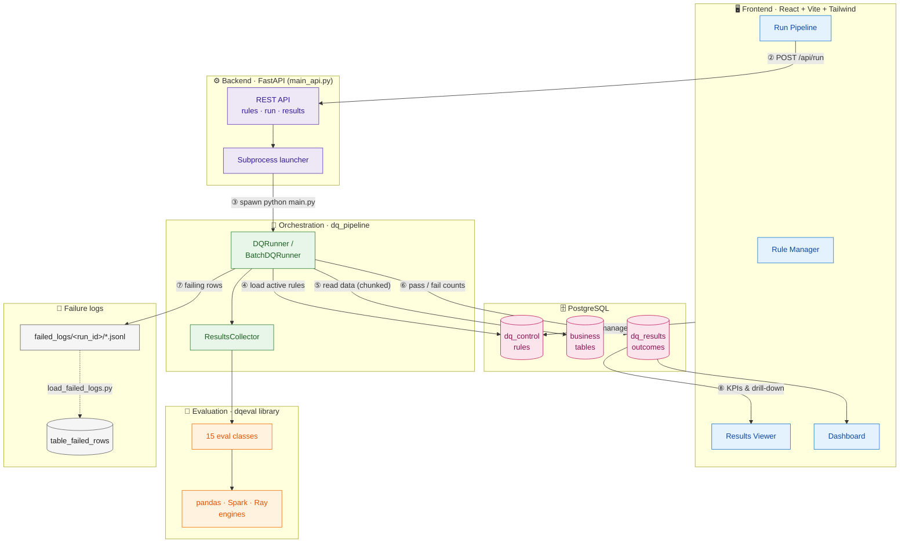

# Data Quality Evaluation (DQ Eval)

Last Updated: 03 August 2026

> **Note:** This asset is intended for internal use within Microsoft.

## About

**DQ Eval** is a configuration-driven Data Quality platform for PostgreSQL. Validation rules are stored as metadata (not code), executed by a reusable multi-engine Python library (`dqeval`), orchestrated by a chunk-aware pipeline (`dq_pipeline`), exposed through a FastAPI backend, and visualized in a React dashboard.

Define a rule once → run it against a table of any size → see pass/fail KPIs and drill into the exact rows that failed.

## Key Contributors
- **Creation Date**: August 2026
- **Last Update**: 03 August 2026
- **Owners**:
- Ram Yerabotu ([ramyerrabotu@microsoft.com](mailto:ramyerrabotu@microsoft.com))
- **Reviewers**:
- RK Iyer ([raiy@microsoft.com](mailto:raiy@microsoft.com))
- Ram Yerabotu ([ramyerrabotu@microsoft.com](mailto:ramyerrabotu@microsoft.com))

- **Contributors**:
- Ram Yerabotu ([ramyerrabotu@microsoft.com](mailto:ramyerrabotu@microsoft.com))
- MuraliKrishnan N ([murn@microsoft.com](mailto:murn@microsoft.com))
- HariKrishnan S ([hariks@microsoft.com](mailto:hariks@microsoft.com))
- Mallikarjun Kotgire ([mkotgire@microsoft.com](mailto:mkotgire@microsoft.com))

---

## Table of Contents

- [Architecture](#architecture)
- [Project Structure](#project-structure)
- [How It Works — End to End](#how-it-works--end-to-end)
- [The `dqeval` Library](#the-dqeval-library)
- [Supported Validation Checks](#supported-validation-checks)
- [Database Schema](#database-schema)
- [Prerequisites](#prerequisites)
- [Setup](#setup)
- [Running the Web UI](#running-the-web-ui)
- [Running the Pipeline (CLI)](#running-the-pipeline-cli)
- [Using the UI](#using-the-ui)
- [API Reference](#api-reference)
- [Verify It Works](#verify-it-works)
- [Environment Variables](#environment-variables)
- [Utility Scripts](#utility-scripts)
- [Troubleshooting](#troubleshooting)
- [Security Notes](#security-notes)

---

## Architecture


```mermaid
flowchart TB
    subgraph UI["🖥️ Frontend · React + Vite + Tailwind"]
        direction LR
        RM["Rule Manager"]
        RP["Run Pipeline"]
        RV["Results Viewer"]
        DASH["Dashboard"]
    end

    subgraph BE["⚙️ Backend · FastAPI (main_api.py)"]
        direction LR
        API["REST API<br/>rules · run · results"]
        SUB["Subprocess launcher"]
    end

    subgraph PIPE["🔀 Orchestration · dq_pipeline"]
        direction LR
        RUNNER["DQRunner /<br/>BatchDQRunner"]
        RC["ResultsCollector"]
    end

    subgraph LIB["🧪 Evaluation · dqeval library"]
        direction LR
        EVALS["15 eval classes"]
        ENGINES["pandas · Spark · Ray<br/>engines"]
    end

    subgraph DATA["🗄️ PostgreSQL"]
        direction LR
        DQC[("dq_control<br/>rules")]
        BIZ[("business<br/>tables")]
        DQR[("dq_results<br/>outcomes")]
    end

    subgraph FILES["📁 Failure logs"]
        direction LR
        LOGS["failed_logs/&lt;run_id&gt;/*.jsonl"]
        FAILROWS[("table_failed_rows")]
    end

    UI -->|"① manage rules"| DQC
    RP -->|"② POST /api/run"| API
    API --> SUB
    SUB -->|"③ spawn python main.py"| RUNNER
    RUNNER -->|"④ load active rules"| DQC
    RUNNER -->|"⑤ read data (chunked)"| BIZ
    RUNNER --> RC
    RC --> EVALS --> ENGINES
    RUNNER -->|"⑥ pass / fail counts"| DQR
    RUNNER -->|"⑦ failing rows"| LOGS
    LOGS -.->|"load_failed_logs.py"| FAILROWS
    DQR -->|"⑧ KPIs & drill-down"| RV
    DQR --> DASH

    classDef ui fill:#e3f2fd,stroke:#1976d2,color:#0d47a1;
    classDef be fill:#ede7f6,stroke:#5e35b1,color:#311b92;
    classDef pipe fill:#e8f5e9,stroke:#2e7d32,color:#1b5e20;
    classDef lib fill:#fff3e0,stroke:#ef6c00,color:#e65100;
    classDef db fill:#fce4ec,stroke:#c2185b,color:#880e4f;
    classDef files fill:#f5f5f5,stroke:#616161,color:#212121;

    class RM,RP,RV,DASH ui;
    class API,SUB be;
    class RUNNER,RC pipe;
    class EVALS,ENGINES lib;
    class DQC,BIZ,DQR db;
    class LOGS,FAILROWS files;
```

| Layer | Technology | Responsibility |
|---|---|---|
| `dqeval/` | Python (pandas / Spark / Ray) | Engine-agnostic evaluation library — 15 rule types |
| `dq_pipeline/` | Python + SQLAlchemy | Metadata-driven orchestration against PostgreSQL |
| `backend/` | FastAPI | REST API — rules CRUD, run triggering, results/failure queries |
| `frontend/` | React + Vite + Tailwind + TypeScript | Rule Manager, Run Pipeline, Results Viewer, Dashboard |
| Database | PostgreSQL (Azure) | `dq_control`, `dq_results`, business tables |

## Project Structure

```text
Data-Quality-Evaluation/
├── main.py                     # CLI entry point — chunked pandas pipeline
├── compare_tables.py           # Ad-hoc source/target Unicode comparison utility
├── load_failed_logs.py         # Promote JSONL failure logs → <table>_failed_rows
├── requirements.txt            # Root Python deps (pipeline + dqeval)
├── dqeval.yml                  # Full example config for every check type
├── setup.ps1                   # One-shot Windows setup script
├── start_backend.ps1 / start_frontend.ps1
│
├── dqeval/                     # Engine-agnostic evaluation library
│   ├── base.py                 # BaseDQEval abstract base + ConfigValidator hook
│   ├── dataframe.py            # DqEvalDataFrame (pandas/Spark/Ray auto-detect)
│   ├── results_collector.py    # Dispatches a rule config to its eval class
│   ├── evals/                  # 15 check implementations (one file per rule)
│   ├── core/
│   │   ├── engine_runner.py    # EngineRunner — selects the compute backend
│   │   └── engine/             # PandasEngine / SparkEngine / RayEngine
│   ├── log/                    # Logging helpers
│   └── utils/                  # ConfigValidator, exceptions, time utils
│
├── dq_pipeline/                # Metadata-driven orchestration
│   ├── config.py               # DBConfig — env-based connection settings
│   ├── db.py                   # SQLAlchemy engine factory
│   ├── runner.py               # DQRunner — single-table evaluation
│   └── batch_runner.py         # BatchDQRunner — chunked, multi-table run
│
├── backend/                    # FastAPI REST API
│   ├── main_api.py             # All /api/* endpoints
│   ├── requirements.txt        # Backend-only deps (FastAPI, azure-identity, …)
│   └── Dockerfile
│
├── frontend/                   # React + Vite dashboard
│   └── src/
│       ├── pages/              # Dashboard, RuleManager, RunPipeline,
│       │                       #   ResultsViewer, ValidationCatalog
│       ├── components/         # DynamicConfigForm, TableHealthMatrix, …
│       ├── context/            # Theme / Sidebar / Toast providers
│       └── api/client.ts       # Typed fetch wrapper for the backend
│
├── sql_queries/                # DDL + reference queries (dq_control, dq_results, indexes)
└── failed_logs/                # Per-run JSONL failure logs (<run_id>/<table>.jsonl)
```

## How It Works — End to End

1. **Define rules** — a rule (schema + table + check type + JSON config) is created via the Rule Manager UI (or directly with SQL) and stored as a row in the `dq_control` table.
2. **Trigger a run** — clicking "Run Pipeline" in the UI calls `POST /api/run`, which spawns `python main.py` as a subprocess with a generated `run_id`.
3. **Load rules** — `DQRunner`/`BatchDQRunner` loads all `is_active = TRUE` rows from `dq_control` and groups them by `(schema_name, table_name)`.
4. **Evaluate** — for each table, the data is read from Postgres (in full, or streamed in chunks for huge tables), wrapped in a `DqEvalDataFrame`, and every rule is executed through `ResultsCollector`, which dispatches to the matching `dqeval` eval class.
5. **Persist results** — aggregated pass/fail counts are written to `dq_results`; the exact rows that failed each check are streamed to `failed_logs/<run_id>/<table_name>.jsonl` (kept out of the DB to stay lightweight).
6. **Visualize** — the Dashboard and Results Viewer pages read back `dq_results` (and the failure logs) through the FastAPI backend, showing KPIs, charts, and row-level drill-downs.
7. **(Optional) Promote failures to SQL** — `load_failed_logs.py` flattens the JSONL failure logs into queryable `<table>_failed_rows` Postgres tables.

## The `dqeval` Library

`dqeval` is the core, engine-agnostic evaluation engine — it knows nothing about Postgres or the UI, only "given this dataframe and this config, what passed or failed."

- **`DqEvalDataFrame`** wraps a raw dataframe and auto-detects whether it's pandas, Spark (incl. Spark Connect), or Ray.
- **`BaseDQEval`** is the abstract base every check extends — it requires `run(evaluation="basic"|"advanced")` and `expected_config()` (a declarative config schema enforced by `ConfigValidator` before execution).
- **Eval classes** (`dqeval/evals/*.py`) contain only config validation/dispatch logic.
- **`EngineRunner`** + per-engine classes (`PandasEngine`, `SparkEngine`, `RayEngine`, all extending `BaseEngine`) contain the actual computation — one implementation per backend.
- **`"basic"` vs `"advanced"` mode**: basic returns a JSON summary (status, total/failed/passed counts); advanced additionally returns a dataframe of the exact failing rows, which is what powers the failed-row drill-down in the UI.

Because dispatch is purely based on the dataframe's detected engine, the same rule config works unmodified whether the underlying data is a small pandas table or a massive Spark table.

## Supported Validation Checks

| `dqmethod` | Category | What it checks |
|---|---|---|
| `DupEval` | Integrity | Duplicate rows based on one or more key columns |
| `EmptyEval` | Completeness | Null / blank values in selected columns |
| `UniqueEval` | Integrity | A column's values are unique across all rows |
| `DtypeEval` | Schema | Column values convert cleanly to expected types |
| `StringFormatEval` | Validity | Text matches a regex pattern (email, UUID, date, etc.) |
| `RangeEval` | Validity | Numeric column falls within a min/max range |
| `CategoricalValuesEval` | Validity | Column values are within an allowed set |
| `StatisticalDistributionEval` | Distribution | Feature drift (mean/std vs. reference) or label balance |
| `DataFreshnessEval` | Timeliness | Timestamp column is within a freshness threshold (e.g. `-2h`) |
| `ReferentialIntegrityEval` | Integrity | Foreign-key-style match against a reference table/column |
| `RowCountEval` | Volume | Table row count falls within a min/max range |
| `CustomEval` | Flexible | Arbitrary Python lambda applied per-column or per-row |
| `SchemaValidationEval` | Schema | Dataframe schema matches an expected column→type mapping |
| `DateRangeEval` | Validity | Date/datetime values in a column fall within a min/max date range |
| `MojibakeEval` | Validity | Detects mojibake (garbled text from encoding mismatches, e.g. UTF-8 decoded as Latin-1) and Unicode replacement characters in a text column |

See `dqeval.yml` for a full example configuration of every check type, and the **Validation Catalog** page in the UI for a live reference.

## Database Schema

- **`dq_control`** — the rule catalog: `control_id, schema_name, table_name, dqmethod, config (JSONB), is_active, created_at`.
- **`dq_results`** — check outcomes: `run_id, schema_name, table_name, dqmethod, col, status, run_timestamp, dqevalcount`, primary key on `(run_id, schema_name, table_name, dqmethod, col)`.
- **`<table>_failed_rows`** — created on demand by `load_failed_logs.py` from the JSONL failure logs.

DDL and reference queries live in `sql_queries/` (`dq_control_query.sql`, `dq_results_query.sql`, `dq_indexes.sql`).

## Prerequisites

| Tool | Version | Check |
|---|---|---|
| Python | 3.10+ | `python --version` |
| Node.js | 18+ | `node --version` |
| npm | 9+ | `npm --version` |
| PostgreSQL | 13+ | `psql --version` |
| Git | any | `git --version` |

> **Azure users only:** If your PostgreSQL is Azure Database for PostgreSQL with Entra (AAD) authentication, you also need the [Azure CLI](https://learn.microsoft.com/cli/azure/install-azure-cli) installed and logged in (`az login`).

## Setup

You can set everything up in one shot with the included script, or follow the manual steps.

### Quick Setup (Windows)

`setup.ps1` walks you through the whole thing: it collects your PostgreSQL connection details, writes the `.env` file, installs Python (root + backend) and frontend dependencies, and creates the `dq_control` / `dq_results` tables.

```powershell
git clone "https://github.com/Murali10052003/Data-Quality-Evaluation.git"
cd Data-Quality-Evaluation
./setup.ps1
```

Prefer to do it by hand (or not on Windows)? Follow the manual steps below.

### 1. Clone the Repository

```bash
git clone "https://github.com/Murali10052003/Data-Quality-Evaluation.git"
cd Data-Quality-Evaluation
```

### 2. Configure the Database Connection

**2.1 Create your `.env` file** by copying the template:

```bash
cp .env.example .env
```

Open `.env` and fill in your PostgreSQL connection details:

```env
# ── PostgreSQL connection ────────────────────────────────
DQ_DB_HOST=localhost          # your Postgres host (e.g. localhost, 10.0.0.5, mydb.postgres.database.azure.com)
DQ_DB_PORT=5432               # default Postgres port
DQ_DB_NAME=mydb               # your database name
DQ_DB_USER=postgres           # your database username
DQ_DB_PASSWORD=changeme       # your database password (see 2.2 for Azure AAD token)

# ── Schema and metadata tables ───────────────────────────
DQ_DB_SCHEMA=public           # schema where your business tables live
DQ_CONTROL_TABLE=dq_control   # leave as-is unless you renamed it
DQ_RESULTS_TABLE=dq_results   # leave as-is unless you renamed it

# ── Pipeline behaviour ───────────────────────────────────
DQ_LOG_LEVEL=INFO             # DEBUG | INFO | WARNING | ERROR
```

**2.2 Azure Entra (AAD) token authentication (Azure users only).** If your PostgreSQL uses Azure AD authentication instead of a static password, fetch a token and set it as the password:

**PowerShell:**
```powershell
az login
$token = az account get-access-token --resource https://ossrdbms-aad.database.windows.net --query accessToken --output tsv
# Update .env
$content = Get-Content -Path .env
$updated = $content -replace '^DQ_DB_PASSWORD=.*', "DQ_DB_PASSWORD=$token"
Set-Content -Path .env -Value $updated
```

**Bash/Zsh:**
```bash
az login
TOKEN=$(az account get-access-token --resource https://ossrdbms-aad.database.windows.net --query accessToken --output tsv)
sed -i "s/^DQ_DB_PASSWORD=.*/DQ_DB_PASSWORD=$TOKEN/" .env
```

> **Note:** Azure tokens expire in ~75 minutes. The backend auto-refreshes them at runtime via `azure-identity`, but you may need to re-run `az login` if your session expires.

**2.3 SSL mode.** The pipeline defaults to `sslmode=require`. If your local PostgreSQL does not use SSL, you can either configure SSL on your Postgres server (recommended), or — for local-only development — temporarily change `?sslmode=require` to `?sslmode=prefer` or `?sslmode=disable` in the connection URL in `dq_pipeline/config.py` (the `url` property, around line 58).

### 3. Create the Metadata Tables

Connect to your PostgreSQL database using `psql`, pgAdmin, Azure Data Studio, or any SQL client and run the DDL scripts in `sql_queries/` to create the two required metadata tables where DQ Eval stores rules and results:

```sql
-- From: sql_queries/dq_control_query.sql (CREATE TABLE part only)

CREATE TABLE dq_control (
    control_id SERIAL PRIMARY KEY,
    schema_name VARCHAR(100) NOT NULL,
    table_name VARCHAR(100) NOT NULL,
    dqmethod VARCHAR(100) NOT NULL,
    config JSONB NOT NULL,
    is_active BOOLEAN DEFAULT TRUE,
    created_at TIMESTAMP DEFAULT CURRENT_TIMESTAMP
);
```

```sql
-- From: sql_queries/dq_results_query.sql

CREATE TABLE dq_results (
    run_id         TEXT         NOT NULL,
    schema_name    TEXT         NOT NULL,
    table_name     TEXT         NOT NULL,
    dqmethod       TEXT         NOT NULL,
    col            TEXT         NOT NULL DEFAULT 'N/A',
    status         TEXT,
    run_timestamp  TIMESTAMPTZ,
    dqevalcount    BIGINT       DEFAULT 0,
    PRIMARY KEY (run_id, schema_name, table_name, dqmethod, col)
);
```

> Optionally apply `sql_queries/dq_indexes.sql` for the recommended indexes on the results table.

### 4. Install Dependencies

**4.1 Python (pipeline + backend).** Create and activate a virtual environment first:

**PowerShell (Windows):**
```powershell
python -m venv .venv
.venv\Scripts\Activate.ps1
```

**Bash/Zsh (macOS/Linux):**
```bash
python3 -m venv .venv
source .venv/bin/activate
```

Then install dependencies:

```bash
pip install -r requirements.txt
pip install -r backend/requirements.txt
```

**4.2 Node.js (frontend).**

```bash
cd frontend
npm install
cd ..
```

## Running the Web UI

You need **two terminals** — one for the backend, one for the frontend.

### Option A: PowerShell scripts (Windows)

```powershell
./start_backend.ps1    # installs deps, fetches an Azure AD token, starts FastAPI on :8000
./start_frontend.ps1   # npm install if needed, starts Vite dev server on :3030
```

### Option B: Manual commands (any OS)

**Terminal 1 — Backend:**
```bash
cd backend
python -m uvicorn main_api:app --reload --port 8000
```

**Terminal 2 — Frontend:**
```bash
cd frontend
npm run dev
```

Then open **http://localhost:3030**. The Vite dev server automatically proxies all `/api/*` calls to the FastAPI backend on port 8000.

## Running the Pipeline (CLI)

You can run data quality checks directly from the command line, without the UI:

```powershell
python main.py                                # all active rules, default 500,000 rows per chunk
$env:DQ_BATCH_SIZE=1000000; python main.py    # custom chunk size for large tables
```

Optional filters (also used internally by the UI's Run Pipeline page):

```powershell
# PowerShell
$env:DQ_FILTER_SCHEMA="public"
$env:DQ_FILTER_TABLE="employee_lowdata"
python main.py

# Bash
DQ_FILTER_SCHEMA=public DQ_FILTER_TABLE=employee_lowdata python main.py
```

## Using the UI

1. **Rule Manager** (`/rules`) — define what gets checked: pick schema → table → check type → fill in the config form → Save. Rules can be toggled active/inactive or bulk-deleted.
2. **Validation Catalog** (`/catalog`) — a reference of all 15 check types with descriptions and config shapes.
3. **Run Pipeline** (`/run`) — pick a schema/table to scope the run (or leave blank to run everything active) and click Run. Progress streams live from the pipeline's log output. **Do not select `dq_control` or `dq_results` as the table** — those are metadata tables, not business tables, and selecting them will match zero rules.
4. **Results Viewer** (`/results`) — filter results by run/table/method/status, drill into failing rows, export to CSV or download the raw JSONL.
5. **Dashboard** (`/dashboard`) — KPI cards, pass/fail charts, and a per-table health matrix.

## API Reference

The FastAPI backend (`backend/main_api.py`) exposes the endpoints below under `http://localhost:8000`. Interactive docs are available at `http://localhost:8000/docs` (Swagger UI) while the backend is running.

### Discovery

| Method | Endpoint | Description |
|---|---|---|
| `GET` | `/api/schemas` | List non-system schemas |
| `GET` | `/api/tables?schema=` | List base tables in a schema |
| `GET` | `/api/columns?schema=&table=` | List columns and data types for a table |

### Rules (`dq_control`)

| Method | Endpoint | Description |
|---|---|---|
| `GET` | `/api/rules?schema=&table=&active_only=` | List rules (optionally filtered) |
| `POST` | `/api/rules` | Create a rule; returns `409` if an identical active rule exists |
| `PATCH` | `/api/rules/{control_id}` | Toggle a rule's `is_active` flag |
| `DELETE` | `/api/rules/{control_id}` | Delete a rule |
| `POST` | `/api/validate-lambda` | AST-only validation of a `CustomEval` lambda (never executed) |

### Runs

| Method | Endpoint | Description |
|---|---|---|
| `POST` | `/api/run` | Spawn the pipeline for an optional schema/table; returns a `run_id` |
| `GET` | `/api/run/{run_id}/status` | Poll run status with the streamed log tail |
| `GET` | `/api/runs` | List past runs |

### Results & Failures

| Method | Endpoint | Description |
|---|---|---|
| `GET` | `/api/results/summary` | KPI summary (pass/fail counts) |
| `GET` | `/api/results/trend` | Pass/fail trend over time |
| `GET` | `/api/results` | Filtered check results |
| `GET` | `/api/failed-rows` | Row-level failures for a specific check |
| `GET` | `/api/failed-rows/export` | Export failing rows as CSV |
| `GET` | `/api/failed-rows/download-jsonl` | Download the raw JSONL failure log |
| `GET` | `/api/failed-logs/runs` | List runs that have failure logs on disk |
| `POST` | `/api/failed-logs/load-to-db` | Promote a run's failure logs into `<table>_failed_rows` |

## Verify It Works

1. Open **http://localhost:3030/rules** — you should see any rules you inserted into `dq_control`.
2. Go to **http://localhost:3030/run** — select your schema and table, then click **Run**.
3. Check **http://localhost:3030/results** — you should see pass/fail results.
4. View **http://localhost:3030/dashboard** — KPI cards and charts.

## Environment Variables

| Variable | Default | Description |
|---|---|---|
| `DQ_DB_HOST` | `localhost` | PostgreSQL hostname |
| `DQ_DB_PORT` | `5432` | PostgreSQL port |
| `DQ_DB_NAME` | `postgres` | Database name |
| `DQ_DB_USER` | `postgres` | Database username |
| `DQ_DB_PASSWORD` | (empty) | Database password or Azure AD token |
| `DQ_DB_SCHEMA` | `public` | Schema for business + metadata tables |
| `DQ_DB_SSLMODE` | `require` | SSL mode (backend only) |
| `DQ_CONTROL_TABLE` | `dq_control` | Rule catalog table name |
| `DQ_RESULTS_TABLE` | `dq_results` | Results table name |
| `DQ_FAILED_LOG_DIR` | `failed_logs` | Directory for failed-row JSONL logs |
| `DQ_BATCH_SIZE` | `500000` | Rows per chunk for large-table streaming |
| `DQ_FILTER_SCHEMA` | (all) | Restrict pipeline to this schema |
| `DQ_FILTER_TABLE` | (all) | Restrict pipeline to this table |
| `DQ_LOG_LEVEL` | `INFO` | Logging verbosity |
| `DQ_CORS_ORIGINS` | (empty) | Extra CORS origins for the backend (comma-separated) |

## Utility Scripts

- **`compare_tables.py`** — ad-hoc source/target Unicode validation comparison (edit the `CONFIG` block at the top to point at your tables).
- **`load_failed_logs.py`** — promotes a run's JSONL failure logs into queryable `<table>_failed_rows` Postgres tables:
  ```powershell
  python load_failed_logs.py                          # most recent run
  python load_failed_logs.py --run-id <uuid>           # specific run
  ```

## Troubleshooting

| Problem | Solution |
|---|---|
| `psycopg` install fails | Run `pip install psycopg[binary]` — requires Python 3.8+ |
| `FATAL: password authentication failed` | Double-check `DQ_DB_USER` and `DQ_DB_PASSWORD` in `.env` |
| `FATAL: no pg_hba.conf entry for host` | Add your IP to the PostgreSQL server's `pg_hba.conf` or Azure firewall rules |
| `SSL connection is required` | Set `sslmode=require` or configure SSL on your Postgres server |
| `sslmode=require` fails on local Postgres | Change sslmode to `prefer` or `disable` in `dq_pipeline/config.py` (around line 58) |
| Azure token expired | Re-run `az login` and restart the backend, or let the auto-refresh handle it |
| Frontend shows network errors | Make sure the backend is running on port 8000 before starting the frontend |
| `npm run dev` port conflict | Port 3030 is hardcoded in `frontend/vite.config.ts` — change it there if needed |
| Tables not showing in Rule Manager | Ensure your tables exist in the schema specified by `DQ_DB_SCHEMA` |

## Security Notes

- The FastAPI backend authenticates to Azure Postgres using **Azure AD tokens** (refreshed automatically via the `az` CLI), rather than a static password.
- `CustomEval` lambda strings are validated with `ast.parse` (structure-only, never executed) via `/api/validate-lambda` before ever reaching the pipeline, where they are resolved with a controlled `eval()` call.
- `.env` is excluded from version control — never commit real credentials.

